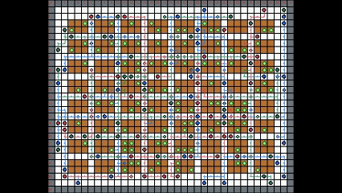
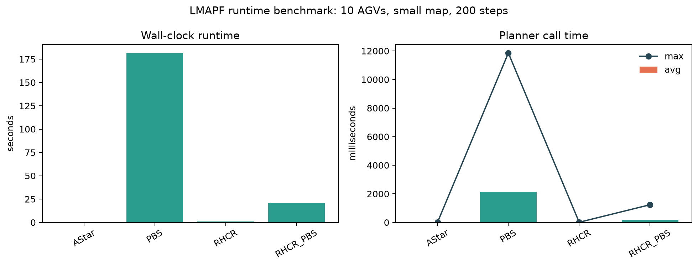

# LMAPF-Simulator

[English](./README.md) | [Italiano](./README.it.md)

仓储多 AGV 仿真环境，面向**终身多智能体路径规划（LMAPF/MAPF）** 研究。基于 PettingZoo `ParallelEnv` 与 Gymnasium，支持可插拔规划器与滚动窗口变体。



<video src="./renders/episode_demo.mp4" controls muted loop playsinline></video>

[查看 MP4 演示](./renders/episode_demo.mp4)

本地生成这段体积和清晰度折中的 MP4 演示：

```bash
python tools/save_episode_video.py
```

可通过 `--sleep` 和 `--fps` 调整移动平滑度与视频时长。

本项目源自 [RWARE](https://github.com/semitable/robotic-warehouse)。部分规划器代码为实验性实现。

## 特点

- **[PettingZoo](https://github.com/Farama-Foundation/PettingZoo/) `ParallelEnv`** 多智能体接口
- **内置仓储地图**：`small` / `medium` / `large` / `long` 四种预设
- **持续任务队列**：到达目标后自动分配新任务
- **冲突裁决**：环境层的有向图 step 自动处理运行时冲突，无需规划器介入，基于 **C++ FastGraph 引擎**
- **可插拔规划器**：A\*、CBS、ECBS、PBS、RHCR 及其变体
- **可视化工具**：地图渲染、FOV 渲染、冲突环演示

## 安装

### 1. 安装 C++ 编译器

C++ FastGraph 引擎和 A\* 引擎在首次导入时会**自动编译**，因此需要预先安装 C++ 编译器：

| 平台 | 编译器 | 安装方式 |
|------|--------|---------|
| **Windows** | MSVC (Visual Studio) | 安装 [Visual Studio 2022 Build Tools](https://visualstudio.microsoft.com/downloads/#build-tools-for-visual-studio-2022)，在安装程序中勾选「使用 C++ 的桌面开发」 |
| **Linux** | GCC ≥ 10 | `sudo apt install build-essential cmake` (Ubuntu/Debian) |
| **macOS** | Clang (Xcode) | `xcode-select --install` |

也可使用 MinGW（Windows）或系统包管理器安装的 GCC。

### 2. 创建 conda 环境（推荐）

```bash
conda create -n lmapf python=3.12 -y
conda activate lmapf
```

### 3. 克隆并安装

```bash
git clone https://github.com/lotjjj/LMAPF-Simulator.git
cd LMAPF-Simulator
pip install -e .
```

主要依赖：`numpy`、`pettingzoo`、`gymnasium`、`pygame`、`matplotlib`、`imageio[ffmpeg]`。

### 4. 验证安装

```python
from LMAPFEnv import WarehouseEnv
from LMAPFEnv.algorithms.path_planners import _HAS_CXX_ASTAR
print("C++ A* engine:", "enabled" if _HAS_CXX_ASTAR else "not available")
```

首次 `import LMAPFEnv` 时，系统会自动检测 C++ 编译器并编译 FastGraph 引擎（耗时约 30-60 秒）。如需手动编译，可运行：

```bash
python build_cpp_graph.py
```

## 快速开始

### 1. 创建环境

```python
from LMAPFEnv import WarehouseEnv

env = WarehouseEnv(
    num_agvs=6,
    map_size="medium",
    render_mode=None,
    max_episode_steps=500,
)
observations, infos = env.reset(seed=42)
```

### 2. 随机动作运行

```python
done = False
while not done:
    actions = {a: env.action_space(a).sample() for a in env.agents}
    obs, rewards, terminations, truncations, infos = env.step(actions)
    done = all(terminations[a] or truncations[a] for a in env.agents)
env.close()
```

### 3. 使用规划器运行

```python
from LMAPFEnv import WarehouseEnv
from LMAPFEnv.algorithms.path_planners import PlannerPolicy

env = WarehouseEnv(
    num_agvs=10,
    map_size="long",
    path_planner="RHCR",
    planner_args={"planning_window": 10, "horizon": 3},
    render_mode="human",
)
obs, infos = env.reset(seed=42)
policy = PlannerPolicy(env.path_planner)

for _ in range(200):
    actions = policy.select_actions(env.agvs, env.agents)
    obs, rewards, terminations, truncations, infos = env.step(actions)
    if not env.agents:
        break
env.close()
```

### 4. 运行基准测试

```bash
# 全部 6 个规划器
python run_benchmark.py

# 单个规划器
python run_benchmark.py --planner RHCR_PBS
```

## 性能



使用 `python run_benchmark.py --steps 200` 在 `long` 地图上测量（10 个 AGV，无渲染，seed 42，随机任务分配）。Elapsed 时间包含环境创建、reset、初始规划和 200 步 rollout。Avg/Max plan time 只统计实际发生的规划调用，跳过未重规划的 step。

| Planner | Steps | Completions | Conflicts | Avg plan (ms) | Max plan (ms) | Elapsed (s) |
|---------|------:|------------:|----------:|--------------:|--------------:|------------:|
| CBS | 200 | 137 | 0 | 4421.2 | 6886.0 | 79.8 |
| ECBS | 200 | 138 | 0 | 13432.3 | 21280.2 | 255.4 |
| PBS | 200 | 137 | 0 | 22338.7 | 27701.2 | 402.4 |
| RHCR_CBS | 200 | 137 | 0 | 605.5 | 2082.8 | 122.3 |
| RHCR_PBS | 200 | 126 | 0 | 87.9 | 500.2 | 18.1 |
| RHCR_ECBS | 200 | 133 | 0 | 211.0 | 2628.3 | 43.0 |

_所有运行都完成了 200 步，没有 disabled/no-path 退出。测试时启用了 C++ FastGraph 引擎和 C++ A\* 规划器引擎，Python 版本为 3.12.13。_

## 示例与工具

| 命令 | 说明 |
|------|------|
| `python examples/run_planner_demo.py --path-planner RHCR --continuous` | 规划器驱动的交互演示 |
| `python examples/conflict_cycle_demo.py` | 冲突环演示 |
| `python tools/save_map_renders.py --map-sizes small medium large long` | 导出地图渲染图 |
| `python tools/save_agent_fov_renders.py --path-planner RHCR --steps 5` | 导出 FOV 渲染图 |
| `python tools/save_episode_video.py` | 录制一段适合 README 展示的紧凑 MP4 episode |

## 规划器

| 类型 | 规划器 |
|------|--------|
| 单体规划 | `AStar`, `EnhancedAStar` |
| MAPF | `CBS`, `ECBS`, `PBS` |
| 滚动窗口 | `RHCR`, `RHCR_CBS`, `RHCR_ECBS`, `RHCR_PBS` |

常用 `planner_args`：`shelf_penalty`、`max_cbs_nodes`、`max_pbs_nodes`、`max_low_level_steps`、`max_planning_time`、`w`、`visible_agv_penalty`、`planning_window`、`horizon`。

## 环境接口

### 核心参数

`WarehouseEnv(num_agvs, map_size, fov_size, max_episode_steps, render_mode, path_planner, planner_args)`

### 任务生成规则

- 任务只会生成在 `shelf` 格。
- 每个存活 AGV 始终维护 `num_visible_tasks` 个激活队列目标，默认值为 `2`。
- 环境要求 `num_agvs * num_visible_tasks <= shelf_count`；不满足时会在创建环境时抛出 `ValueError`。
- AGV 初始位置优先放在 corridor 格，避免占用 shelf 任务目标容量。

### 动作空间

每个 agent 使用 `Discrete(5)`，顺序固定为：

```python
[UP, DOWN, LEFT, RIGHT, STAY]
```

### 观测空间

`obs` 是一个 `gymnasium.spaces.Dict`：

```python
obs = Dict({
    "self_states": Dict({...}),
    "fov": Box(...),
})
```

`self_states` 固定包含：

| 字段 | 形状 | 含义 |
|------|------|------|
| `position` | `(2,)` | 归一化全局坐标 |
| `fov_density` | `(1,)` | FOV 内其他 AGV 密度 |
| `target_rel` | `(2,)` | 相对当前目标的归一化偏移 |
| `target_visible` | `(1,)` | 目标是否位于 FOV 内 |
| `target_dist_norm` | `(1,)` | 到目标的归一化欧氏距离 |

`fov` 的形状为 `(5, fov_size, fov_size)`，5 个通道分别表示：
`corridor`、`wall/OOB`、`shelf`、`other AGVs`、`visible goals`。

### Info

`reset()` 和 `step()` 都返回 `infos[agent_name]`。最常用的字段如下：

| 键 | 含义 |
|-----|------|
| `action_mask` | `[UP, DOWN, LEFT, RIGHT, STAY]` 的局部合法性掩码 |
| `conflicted` | 因冲突解析未被提交执行，被强制停留 |
| `invalid_action` | 请求动作非法，已被替换为 `STAY` |
| `task_completed` | 本步到达当前任务目标 |
| `progress_target_pos` | 本步 reward 参考的目标位置 |
| `progress_distance_prev` | 执行动作前到该目标的距离 |
| `progress_distance_now` | 执行动作后到该目标的距离 |
| `act_val_time_ms` | 动作检查与冲突解析耗时 |
| `planner_meta` | 规划器耗时、超时、禁用状态等诊断信息 |
| `planner_paths` | 所有 agent 的共享路径快照 |

说明：

- `action_mask` 只表示局部可行性，不保证动作最终执行成功；若冲突裁决未提交，该步仍可能 `conflicted=True`。
- `planner_paths` 是全局快照，因此不同 agent 的 `infos[agent]["planner_paths"]` 通常相同。

### 奖励目标时序

如果 agent 在本步完成任务，环境的顺序是：

1. 先冻结本步的 `progress_target_pos`。
2. 基于该目标计算 `progress_distance_prev/now`。
3. 标记 `task_completed=True`。
4. 再推进任务队列，让 `next task` 成为新的 `current task`。

因此：

- `progress_target_pos` 指向刚完成的旧目标，而不是新任务目标。
- `progress_distance_prev/now` 也仍然相对旧目标计算。
- 下一步 observation 已经会通过 `agv.target_pos` 反映新任务。

### 终止与截断

- `terminations[agent]` 始终为 `False`。
- 当达到 `max_episode_steps` 时，所有存活 agent 的 `truncations[agent]` 变为 `True`。
- 若拥堵窗口内超过半数 agent 停留在同一位置，环境也会截断所有存活 agent。
- 本步被终止或截断的 agent 会在下一步前从 `env.agents` 中移除。

### 默认奖励

```python
reward = each_step_reward
       + invalid_action_penalty
       + conflict_penalty
       + progress_shaping_weight * clip(d_prev - d_now, -1, 1)
       + task_completion_reward
```

默认值：

- `each_step_reward = -0.002`
- `invalid_action_penalty = -0.05`
- `conflict_penalty = -0.6`
- `progress_shaping_weight = 0.01`
- `task_completion_reward = +2.0`

## License

MIT License
